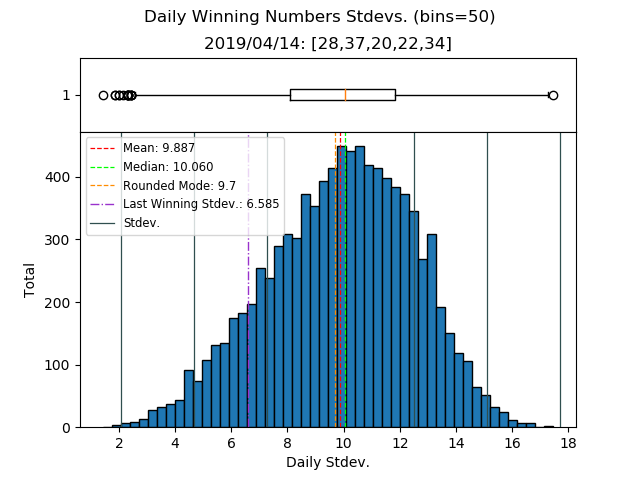
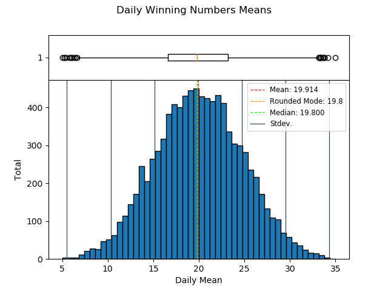
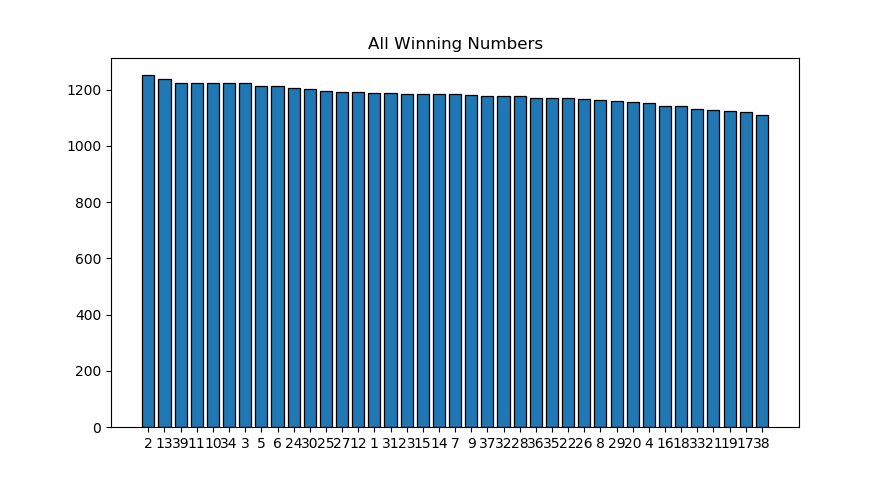

# Fantasy 5 Parser

Parses calottery's .txt file of Fantasy5 results. Prints stats on each number. Also, saves ```raw_numbers.txt``` containing only results on each line.

todo: more stats, matlab plots

```Python 3.6.8```

## Options
```python3 fantasy5stats.py --help```

## Example Output (2019/04/14)







