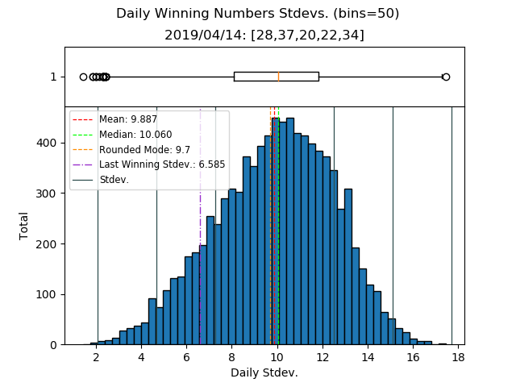
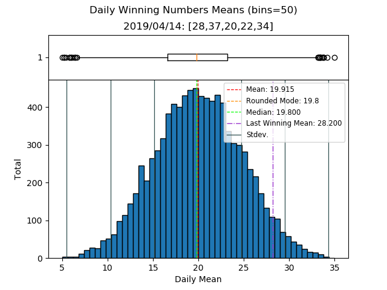
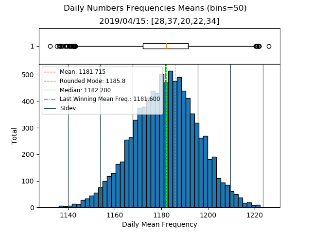
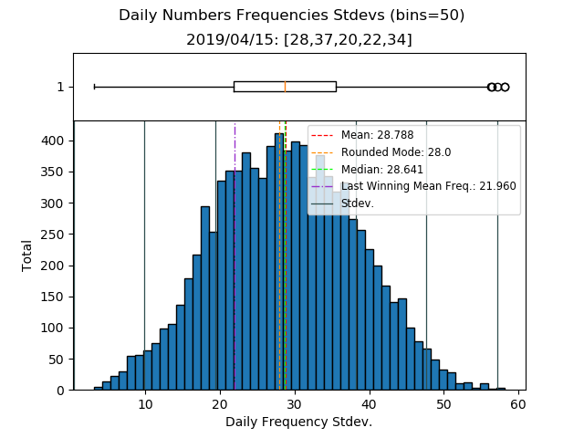
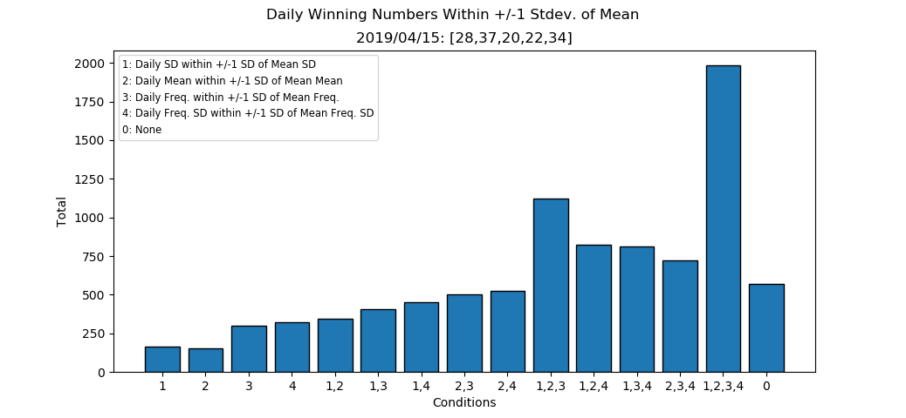
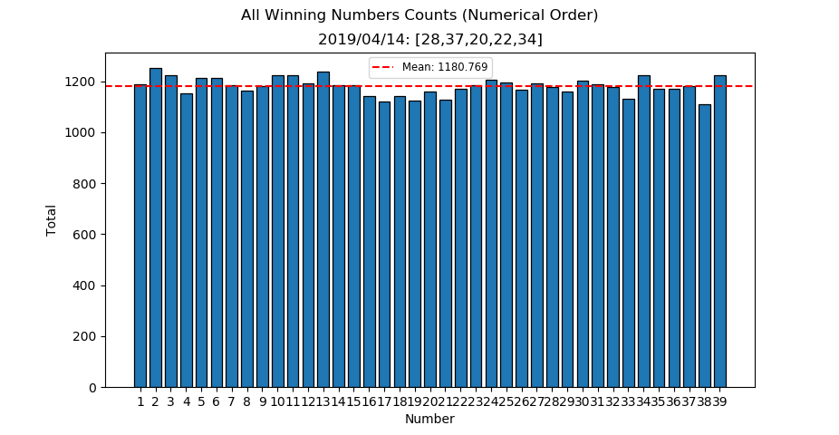

# Fantasy 5 Parser

NOTE: calottery no longer provides the .txt file containing historical data that this program uses. ```fantasy5results.txt``` provides until 09/04/2019, which can be used with ```--use-local```

TODO: rewrite program to use JSON from REST API (explained below)

Poking around the site, I found that historical data can be fetched with a REST API that returns a JSON:

```
GET /api/DrawGameApi/DrawGamePastDrawResults/9/1/20 HTTP/1.1
Host: www.calottery.com
```

where the parameters are ```/Game ID#/Page#/Total```

Explanation:

```Game ID#``` to Game -
* 9: Daily3
* 10: Fantasy 5
* 11: Daily Derby
* 12: Powerball

```Page#/Total``` -

```Total``` indicates how many draws to return. It can range from 1 to 50.

```Page#``` indicates which index of ```Total``` to return.

For example,

```1/20``` returns the 20 most recent draws, i.e. draws 1-20

```2/20``` returns draws 21-40

```3/20``` returns draws 41-60

and so on

So, it is possible with a multiple API calls and combination of returned JSONs to get all historical data as this program requires.

----

Parses calottery's .txt file of Fantasy5 results. Prints stats on each number. Also, saves ```raw_numbers.txt``` containing only results on each line.

todo: more stats, matlab plots

```Python 3.6.8```

## Options
```python3 fantasy5stats.py --help```

## Example Output













